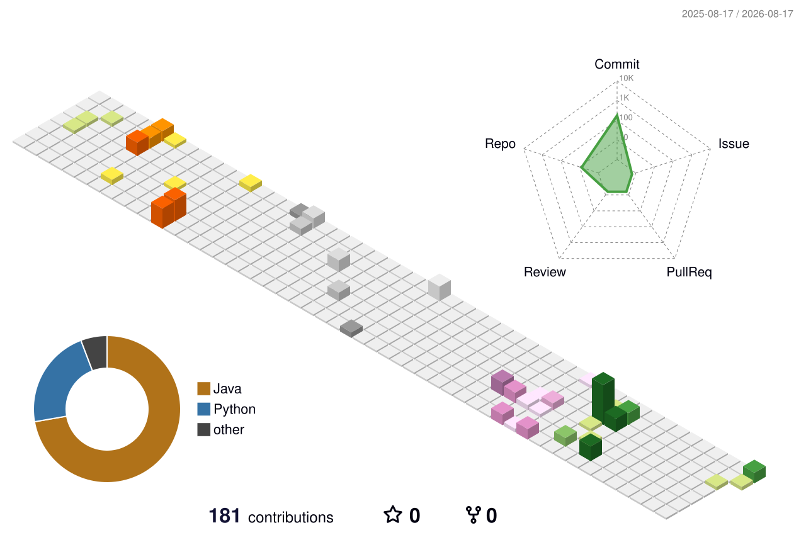

 

## About

I'm a backend developer focused on Java and Python.

I build backend services, REST APIs, integrations and automation tools, with a strong interest in distributed systems, high-load applications and fintech.

Currently focused on:

* Java & Spring Boot
* PostgreSQL, Redis & Kafka
* Docker & Linux
* Algorithms, concurrency and JVM internals

## Studying

🎓 Belarusian State University 
☕ T-Academy — Java Backend

## Tech Stack

### Backend

`Java` `Spring Boot` `Spring Data` `Spring Security`
`Python` `FastAPI` `Quart` `aiohttp`
`REST` `gRPC` `AsyncIO`

### Data & Messaging

`PostgreSQL` `Redis` `Kafka` `SQLite`

### Engineering

`Docker` `Linux` `Git` `JUnit 5` `JaCoCo` `Maven`

### Resume

[📄 Русское CV](./Тимофей_Логвин_CV.pdf)

[📄 English CV](./Timothy_Logvin_CV.pdf)

## Featured Projects

### PS Store Tracker

Backend service for tracking PlayStation Store data and automating price/content monitoring.

**Focus:** external APIs · parsing · asynchronous processing · persistence · automation

[Repository](https://github.com/Koalko99/ps-store-tracker)

---

### Fractal Flame

Multithreaded Java implementation of the Fractal Flame algorithm based on Chaos Game.

**Highlights:**

* Single-threaded and multithreaded rendering
* Multiple transformation functions
* JSON and CLI configuration
* Input validation
* PNG generation
* Automated tests

**Stack:** `Java` `Maven` `JUnit` `Concurrency`

[Repository](https://github.com/Koalko99/fractal-flame)

---

### Labyrinths

Java application for procedural maze generation and path finding.

**Implemented algorithms:**

`DFS` `Hunt-and-Kill` `Kruskal` `Prim`
`BFS` `Dijkstra` `A*` `Lee`

**Stack:** `Java` `Maven` `JUnit` `Docker`

[Repository](https://github.com/Koalko99/labyrinths)

---

### ISEI Schedule

Asynchronous schedule parser and Telegram bot for students and teachers.

**Highlights:**

* Async parser and bot working in parallel
* Teacher and student profiles
* Schedule caching
* Telegram interface
* Works independently from the university website

**Stack:** `Python` `Aiogram` `BeautifulSoup` `SQLite` `AsyncIO`

[Repository](https://github.com/Koalko99/isei-schedule)

## GitHub Stats

  

